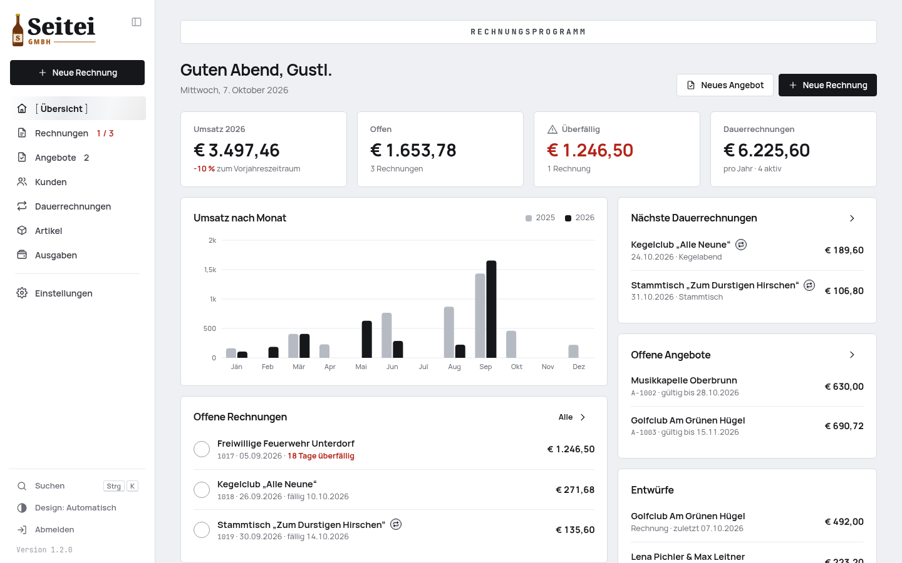
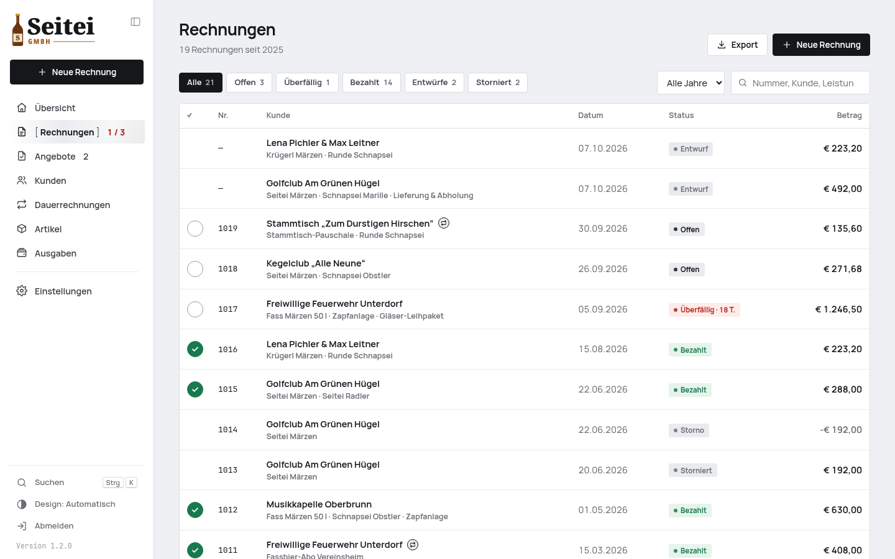
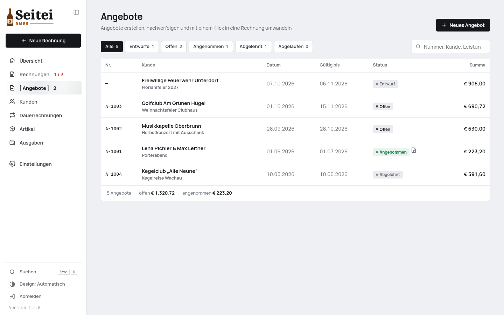
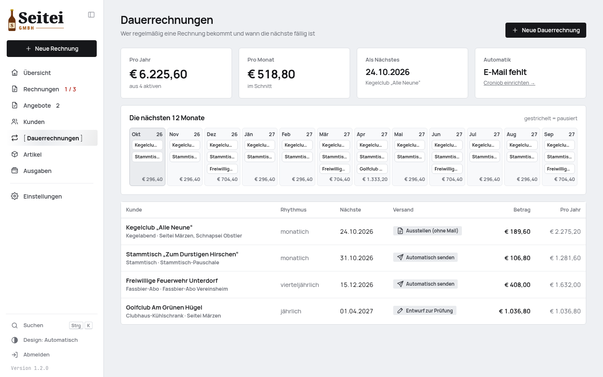
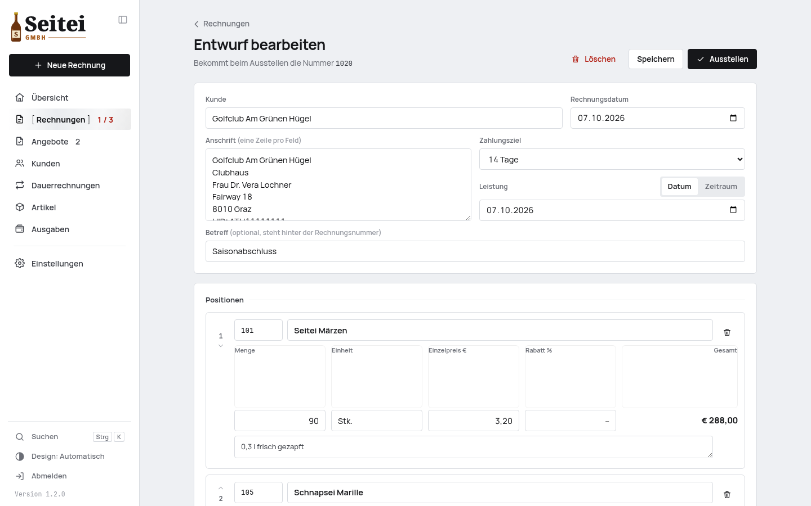
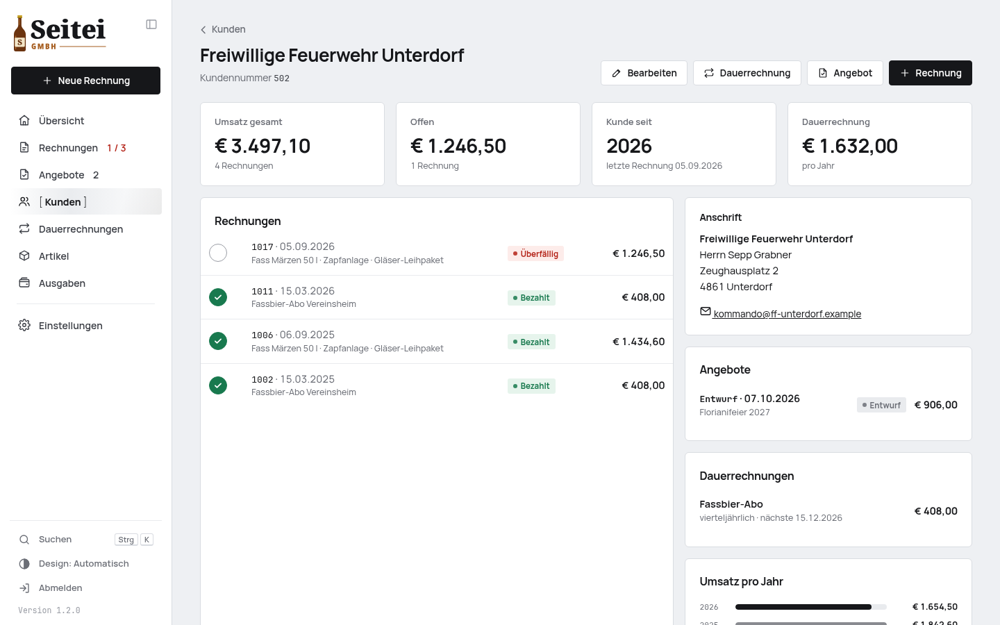
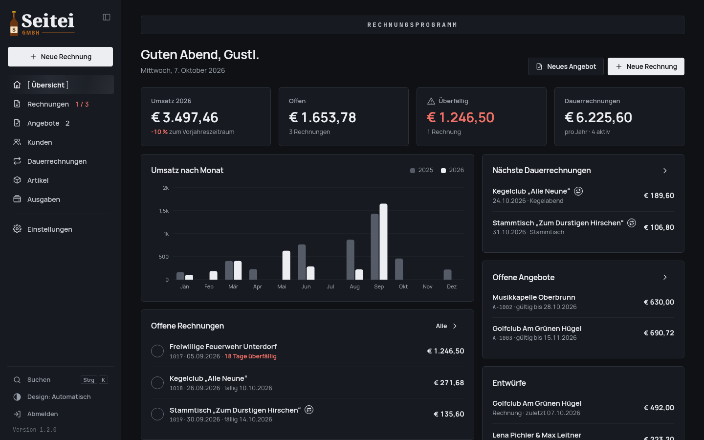
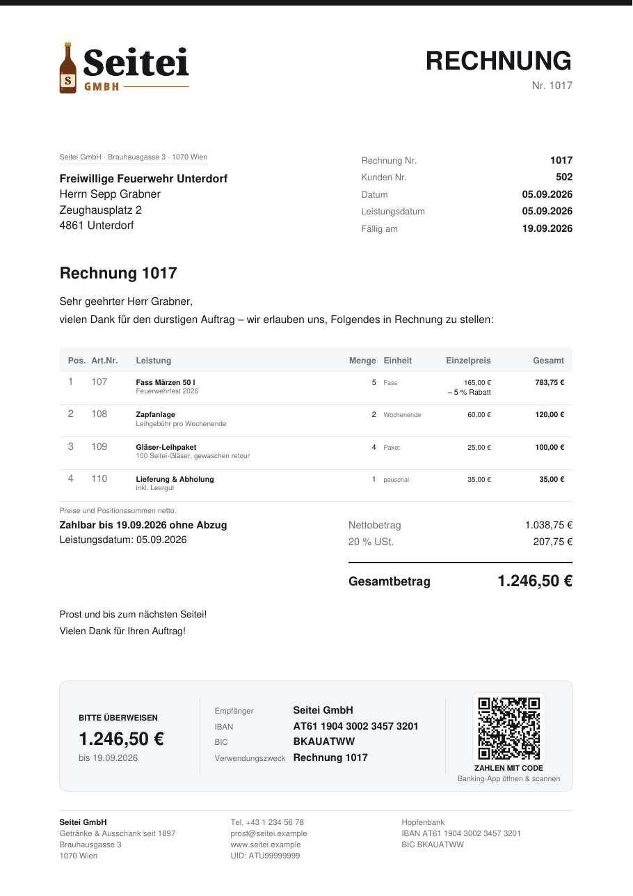
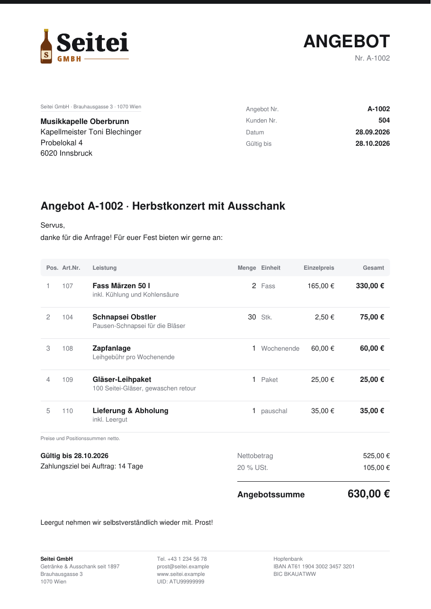
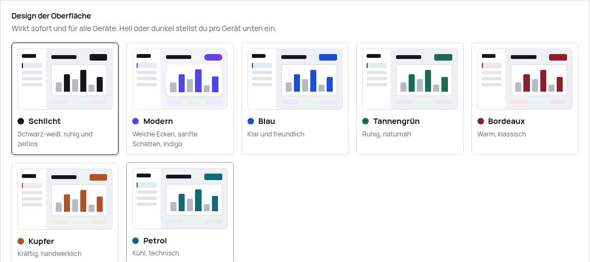

<p align="center">
  
</p>

<h1 align="center">Rechnungsprogramm</h1>

<p align="center">
  Rechnungen, Angebote und Dauerrechnungen für Selbstständige und kleine Firmen in Österreich.<br>
  <b>PHP + SQLite, keine Abhängigkeiten, kein Build-Schritt</b> – läuft auf jedem Webhosting<br>
  und fühlt sich trotzdem an wie eine moderne App, am Desktop wie am Handy.
</p>

<p align="center">
  <a href="../../releases/latest">Neueste Version</a> ·
  <a href="docs/beispiel-rechnung.pdf">Beispielrechnung (PDF)</a> ·
  <a href="docs/beispiel-angebot.pdf">Beispielangebot (PDF)</a>
</p>

> Die Screenshots zeigen die Demo-Firma **Seitei GmbH** – Getränke & Ausschank seit 1897.
> Ihre Kundschaft: der Stammtisch „Zum Durstigen Hirschen“, die Feuerwehr Unterdorf und der Kegelclub „Alle Neune“.
> Verrechnet werden Seitei, Krügerl und Schnapsei. Alle Namen und Daten sind erfunden.



<table>
<tr>
<td width="50%"></td>
<td width="50%"></td>
</tr>
<tr>
<td></td>
<td></td>
</tr>
<tr>
<td></td>
<td></td>
</tr>
</table>

## Beispielrechnung und -angebot

<p>
  <a href="docs/beispiel-rechnung.pdf"></a>
  <a href="docs/beispiel-angebot.pdf"></a>
</p>

Das PDF entsteht direkt in PHP, ganz ohne Bibliothek:

- eigenes **Logo** als SVG (Vektor, gestochen scharf), PNG (auch transparent) oder JPG
- Zahlschein mit **SEPA-QR-Code** – Banking-App öffnen, scannen, fertig
- USt.-Ausweis je Steuersatz oder Kleinunternehmer-Hinweis
- Stempel „Bezahlt“, „Storniert“, „Angenommen“, „Abgelehnt“
- **Automatisches Schrumpfen**: Würde nur die Summe oder der Stempel auf einer neuen Seite landen, rücken die Positionszeilen zusammen, damit alles auf eine Seite passt

## Funktionen

**Rechnungen**
- Editor mit **Live-PDF-Vorschau** beim Tippen
- Artikel beim Tippen suchen und übernehmen, Rabatt pro Position, Leistungsdatum oder -zeitraum
- Fortlaufende Nummer erst beim Ausstellen, danach unveränderlich; Korrektur per **Stornorechnung**
- **Zahlungseingang abhaken** direkt in der Liste – mit „Rückgängig“
- Filter (offen, überfällig, bezahlt, Entwürfe, storniert), Jahr, Volltextsuche
- Per E-Mail senden (PDF im Anhang), Zahlungserinnerung, Teilen am Handy, als neue Rechnung kopieren

**Angebote**
- Gleicher Editor wie bei Rechnungen, eigener Nummernkreis (`A-1001` …) und „gültig bis“
- Status offen, angenommen, abgelehnt, abgelaufen
- **Mit einem Klick in eine Rechnung umwandeln** – Positionen und Kunde werden übernommen

**Dauerrechnungen**
- Übersicht, wer regelmäßig eine Rechnung bekommt – mit Jahresleiste der nächsten 12 Monate
- monatlich bis alle 3 Jahre; Platzhalter wie `{MONAT}`, `{JAHR}` oder `{ZEITRAUM}` in Positionstexten
- pro Kunde wählbar: **automatisch senden**, nur ausstellen oder als Entwurf zur Prüfung
- täglicher Cronjob erstellt und versendet fällige Rechnungen
- Wiederkehrende Rechnungen und Kunden sind in allen Listen mit einem runden Symbol gekennzeichnet

**Kunden & Artikel**
- Kundenstamm mit Umsatz, offenen Beträgen, Angeboten, Verlauf, eigener Zahlungsfrist und E-Mail-Kopie
- **PLZ ↔ Ort für Österreich**: Postleitzahl tippen schlägt den Ort vor, Ort tippen schlägt die Postleitzahl vor
- Artikelkatalog mit Kategorien; wiederkehrende Leistungen markierbar

**Übersicht & Auswertung**
- Umsatz im Jahr mit Vorjahresvergleich, Monatsdiagramm, Umsatz pro Jahr, Top-Kunden
- offene und überfällige Rechnungen, offene Angebote, nächste Dauerrechnungen
- **Kleinunternehmergrenze** im Blick (55.000 €)
- Ausgaben mit Belegfoto vom Handy, Überschuss je Jahr
- Export als CSV (Steuerberatung) oder alle Rechnungen als PDF in einer ZIP-Datei

**Design**
- **Sieben Designs** mit Mini-Vorschau: Schlicht, Modern (weiche Ecken, sanfte Schatten) und Farbakzente in Blau, Tannengrün, Bordeaux, Kupfer und Petrol
- Akzentfarbe auf Wunsch auch auf Rechnungen und Angeboten
- Helles und dunkles Design pro Gerät

<p></p>

**Bedienung**
- Suche über alles mit <kbd>Strg</kbd>/<kbd>⌘</kbd> + <kbd>K</kbd>, neue Rechnung mit <kbd>N</kbd>
- Einklappbares Menü, am Handy Menü von links; als App auf den Home-Bildschirm legbar

**Sicherheit & Betrieb**
- Anmeldung mit Passwort, Sperre nach Fehlversuchen, CSRF-Schutz, strenge Content-Security-Policy
- **E-Mail-Zugang direkt in den Einstellungen** – mit Schnellauswahl für Gmail, Microsoft 365, GMX, WEB.DE, iCloud und Testmail
- SMTP nur verschlüsselt mit Zertifikatsprüfung; das Passwort wird verschlüsselt gespeichert, der Schlüssel liegt getrennt von der Datenbank (Sicherungen enthalten es nie im Klartext)
- Hochgeladene Logos werden bereinigt (nur Formen – keine Skripte, Links oder Texte)
- Datenordner per `.htaccess` gesperrt (oder außerhalb des Webverzeichnisses)
- Datenbank-Sicherung per Klick
- **Eingebautes Software-Update** aus den GitHub-Releases – mit automatischer Sicherung und Zurücksetzen

## Installation

Voraussetzungen: PHP ≥ 8.0 mit `pdo_sqlite`, `mbstring`, `openssl`, `dom` (überall Standard), Apache oder nginx.

1. Neuestes [Release](../../releases/latest) laden, `rechnungen.zip` entpacken und den Ordner `rechnungen/` hochladen (z. B. nach `/rechnungen`).
2. Der Ordner `rechnungen/data/` muss für PHP beschreibbar sein.
3. Seite aufrufen und ein Passwort festlegen, dann unter **Einstellungen** Firmendaten, Logo und Bankverbindung eintragen.
4. Unter **Einstellungen → E-Mail** den SMTP-Zugang eintragen und eine Testmail senden
   (alternativ in der `config.php` – die hat dann Vorrang).
5. Für Dauerrechnungen einen täglichen Cronjob anlegen: `php /pfad/zu/rechnungen/cron.php`
   (oder die URL aus *Einstellungen → E-Mail & Automatik*).

Unter **Einstellungen → Sicherheit** prüft das Programm, ob der Datenordner von außen erreichbar ist.
Bei nginx greift die `.htaccess` nicht – dann `data_dir` in der `config.php` auf einen Ordner außerhalb des Webverzeichnisses setzen.

### E-Mail-Versand

Am zuverlässigsten über ein eigenes Postfach der Domain (z. B. `rechnung@deine-domain.at`), SMTP Port 465 (`ssl`) oder 587 (`tls`).
Dann passen SPF/DKIM zur Absenderadresse. Mit `bcc` bekommst du eine Kopie jeder versendeten Rechnung.

## Updates

*Einstellungen → Update* zeigt neue Versionen aus diesem Repository samt Änderungen an.
Ein Klick installiert sie – vorher werden Programm und Datenbank nach `data/updates/` gesichert,
jede Sicherung lässt sich dort wieder einspielen. `data/` und `config.php` werden nie überschrieben.

Ein anderes Repository (z. B. ein eigener Fork) lässt sich in der `config.php` einstellen:

```php
'update' => array( 'repo' => 'benutzer/repo', 'token' => '' ), // token nur bei privatem Repo
```

## Entwicklung

```bash
bin/dev.sh                                         # http://localhost:8090/rechnungen/ (PHP 8.3 über Docker)
NW_DATA_DIR=/app/demo/data bin/php bin/demo.php    # Demo „Seitei GmbH“ (Passwort demo1234)
bin/export.sh [--leer]                             # dist/rechnungen.zip – mit oder ohne Daten
bin/release.sh 1.2.0 "Was ist neu"                 # GitHub-Release für das eingebaute Update
```

| Pfad | Inhalt |
|---|---|
| `rechnungen/index.php`, `assets/` | Oberfläche (Vanilla JS, eine Datei, kein Build) |
| `rechnungen/api.php` | JSON-API |
| `rechnungen/cron.php` | Dauerrechnungen erstellen und versenden |
| `rechnungen/lib/` | Datenbank, Fachlogik, PDF, Logo (SVG), QR-Code, SMTP, ZIP, Updater |
| `rechnungen/data/` | Datenbank, Logo, Belege, Sicherungen – **nie im Repository** |
| `bin/seitei-logo.js` | erzeugt das Demo-Logo (opentype.js, Noto-Schriften) |
| `bin/plz-at.py` | erzeugt `assets/plz-at.json` aus dem GeoNames-Verzeichnis |

## Quellen

Postleitzahlen Österreich: [GeoNames](https://www.geonames.org/) (CC BY 4.0), aufbereitet mit `bin/plz-at.py`.
Schrift der Oberfläche: Manrope (SIL Open Font License).

<p align="center"><sub>Prost! 🍺</sub></p>
