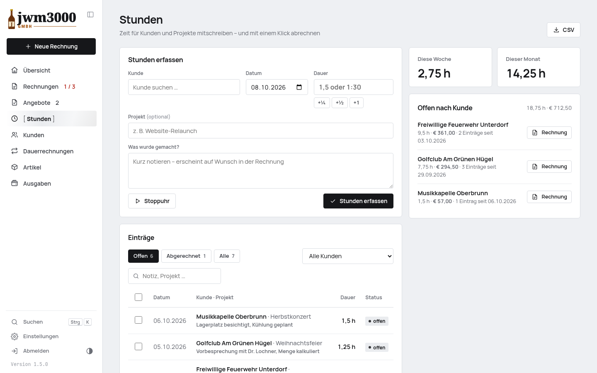

<p align="center">
  
</p>

<h1 align="center">Rechnungsprogramm</h1>

<p align="center">
  Rechnungen, Angebote, Dauerrechnungen und Stunden für Selbstständige und kleine Firmen in Österreich.<br>
  <b>PHP + SQLite · keine Abhängigkeiten · kein Build-Schritt</b> – läuft auf jedem Webhosting<br>
  und fühlt sich an wie eine moderne App, am Desktop wie am Handy.
</p>

<p align="center">
  <a href="../../releases/latest"><b>Neueste Version laden</b></a> ·
  <a href="docs/beispiel-rechnung.pdf">Beispielrechnung (PDF)</a> ·
  <a href="docs/beispiel-angebot.pdf">Beispielangebot (PDF)</a>
</p>

> Die Screenshots zeigen die Demo-Firma **jwm3000 GmbH** – Getränke & Ausschank seit 1897.
> Ihre Kundschaft: der Stammtisch „Zum Durstigen Hirschen“, die Feuerwehr Unterdorf, der Kegelclub „Alle Neune“.
> Verrechnet werden Seitei, Krügerl und Schnapsei. Alle Namen und Daten sind erfunden.


<table>
<tr>
<td width="50%"></td>
<td width="50%"></td>
</tr>
<tr>
<td></td>
<td></td>
</tr>
<tr>
<td></td>
<td></td>
</tr>
<tr>
<td colspan="2"></td>
</tr>
</table>

## Rechnung und Angebot als PDF

<p>
  <a href="docs/beispiel-rechnung.pdf"></a>
  <a href="docs/beispiel-angebot.pdf"></a>
</p>

Das PDF entsteht direkt in PHP, ohne Bibliothek:

- eigenes **Logo** als SVG (Vektor), PNG (auch transparent) oder JPG
- Zahlschein mit **SEPA-QR-Code** – Banking-App öffnen, scannen, fertig
- Spalte „Einheit“ nur, wenn eine Position eine Einheit hat
- USt.-Ausweis je Steuersatz oder Kleinunternehmer-Hinweis
- Teilzahlungen („bereits bezahlt / offen“) und Stempel „Bezahlt“, „Storniert“, „Angenommen“, „Abgelehnt“
- **Automatisches Schrumpfen**: Würde nur die Summe, der Stempel oder der Zahlschein allein auf einer neuen Seite landen, rücken die Positionszeilen zusammen

## Funktionen

**Rechnungen**
- Editor mit **Live-PDF-Vorschau** beim Tippen
- Artikel beim Tippen übernehmen, Rabatt pro Position, Leistungsdatum oder -zeitraum
- Fortlaufende Nummer erst beim Ausstellen, danach unveränderlich; Korrektur per **Stornorechnung**
- **Zahlungseingang abhaken** direkt in der Liste – mit „Rückgängig“
- **Teilzahlungen**: weniger als offen → „teilweise bezahlt“, mehrere Zahlungen je Rechnung
- Per E-Mail senden (PDF im Anhang), Zahlungserinnerung, Teilen am Handy, Kopieren
- **Löschen**: War es die zuletzt vergebene Nummer, wird sie wieder frei – sonst wird weitergezählt

**Angebote**
- Gleicher Editor, eigener Nummernkreis (`A-1001` …), „gültig bis“
- Status offen, angenommen, abgelehnt, abgelaufen
- **Mit einem Klick in eine Rechnung umwandeln**

**Dauerrechnungen**
- Übersicht, wer regelmäßig eine Rechnung bekommt – mit Jahresleiste der nächsten 12 Monate
- monatlich bis alle 3 Jahre; Platzhalter `{MONAT}`, `{JAHR}`, `{ZEITRAUM}` in Positionstexten
- pro Kunde: **automatisch senden**, nur ausstellen oder Entwurf zur Prüfung
- täglicher Cronjob erstellt und versendet fällige Rechnungen
- **E-Mail-Protokoll** in den Einstellungen: jede Mail mit Zeit, Absender, Empfängern (auch CC/BCC), Betreff, Beleg, Anhang, Antwort des Servers oder Fehler
- wiederkehrende Rechnungen sind in allen Listen mit einem Symbol gekennzeichnet

**Stunden**
- Zeit für Kunden und Projekte mitschreiben: Dauer als `1,5`, `1:30` oder `90m`, Schnellknöpfe und **Stoppuhr**
- Notizfeld „Was wurde gemacht?“ – erscheint auf Wunsch als Beschreibung auf der Rechnung
- Eigene Seite mit Filtern, Wochen- und Monatssumme und **offenen Stunden je Kunde**; auch auf der Kundenseite und als Widget in der Übersicht
- Im Rechnungs-Editor einblendbar, sobald der Kunde offene Stunden hat: Einträge wählen, Stundensatz (Standard oder je Kunde) – fertig ist die Position
- Oder **ohne Position bestätigen** (z. B. wenn sie in einer Pauschale stecken) – die Stunden hängen trotzdem an der Rechnung
- Beim Ausstellen gelten die Stunden als **verrechnet** und werden bei keiner weiteren Rechnung mehr angeboten; auch von Hand markierbar und wieder zu öffnen
- Reiter **Verrechnet**: gruppiert **nach Jahr** (mit Monatsbalken) oder **nach Rechnung**, dazu „Ohne Rechnung“ für von Hand markierte; Export als CSV

**Kunden & Artikel**
- Kundenstamm mit Umsatz, offenen Beträgen, Angeboten, Verlauf, eigener Zahlungsfrist
- **PLZ ↔ Ort für Österreich**: Postleitzahl tippen schlägt den Ort vor und umgekehrt
- Artikelkatalog mit Kategorien; wiederkehrende Leistungen markierbar

**Übersicht & Auswertung**
- **Widgets frei anordnen** (Maus, Finger oder Pfeiltasten) und auf eine Zeile minimieren
- Umsatz mit Vorjahresvergleich, Monatsdiagramm, offene und überfällige Beträge, Top-Kunden
- **Kleinunternehmergrenze** im Blick (55.000 €)
- Ausgaben mit Belegfoto vom Handy
- Export als CSV oder alle Rechnungen als PDF in einer ZIP-Datei
- **Speicherplatz** unter *Einstellungen → Daten*: Datenbank, Belege und Sicherungen, Größe je Bereich, Zustandsprüfung und „Datenbank optimieren“

**Design & Bedienung**
- **Sieben Designs** mit Mini-Vorschau: Schlicht, Modern und Farbakzente – auf Wunsch auch auf Rechnungen
- Hell und dunkel, einklappbares Menü, am Handy Menü von links, als App auf dem Home-Bildschirm
- Suche über alles mit <kbd>Strg</kbd>/<kbd>⌘</kbd> + <kbd>K</kbd>, neue Rechnung mit <kbd>N</kbd>

<p></p>

## Sicherheit

- **Ersteinrichtung nur mit Code** aus `data/SETUP-CODE.txt` – niemand kann eine frische Installation übernehmen
- Passwort-Hash (bcrypt), Sperre nach 8 Fehlversuchen je IP bzw. 40 insgesamt in 15 Minuten
- Sitzungs-Cookie `HttpOnly`, `SameSite=Strict`, über HTTPS `Secure`; Änderungen nur per POST mit CSRF-Token
- Strenge **Content-Security-Policy** (keine fremden oder eingebetteten Skripte), Ausgaben durchgehend maskiert
- SQL nur mit vorbereiteten Abfragen; Uploads nach Inhalt geprüft; Logos werden bereinigt (nur Formen)
- **SMTP-Passwort verschlüsselt** (AES-256-GCM), Schlüssel getrennt von der Datenbank; Versand nur über TLS mit Zertifikatsprüfung
- Datenordner per `.htaccess` gesperrt – die App prüft das selbst (Einstellungen → Sicherheit)
- **Updates** nur von GitHub über HTTPS, Prüfsumme wird kontrolliert, vorher automatische Sicherung

## Installation

Voraussetzungen: PHP ≥ 8.0 mit `pdo_sqlite`, `mbstring`, `openssl`, `dom` (überall Standard), Apache oder nginx.

1. Neuestes [Release](../../releases/latest) laden, `rechnungen.zip` entpacken und den Ordner `rechnungen/` hochladen (z. B. nach `/rechnungen`).
2. Der Ordner `rechnungen/data/` muss für PHP beschreibbar sein.
3. Seite aufrufen. Den **Einrichtungscode** aus `rechnungen/data/SETUP-CODE.txt` (per FTP öffnen) eingeben und ein Passwort festlegen.
4. Unter **Einstellungen** Firmendaten, Logo und Bankverbindung eintragen.
5. Unter **Einstellungen → E-Mail** den SMTP-Zugang eintragen und eine Testmail senden.
6. Für Dauerrechnungen einen täglichen Cronjob anlegen: `php /pfad/zu/rechnungen/cron.php`
   (oder die URL aus *Einstellungen → E-Mail & Automatik*).

Bei nginx greift die `.htaccess` nicht – dann `data_dir` in einer `config.php` (Vorlage: `config.sample.php`) auf einen Ordner außerhalb des Webverzeichnisses setzen.

## Updates

*Einstellungen → Update* zeigt neue Versionen samt Änderungen. Ein Klick installiert sie –
vorher werden Programm und Datenbank nach `data/updates/` gesichert, jede Sicherung lässt sich wieder einspielen.
`data/` und `config.php` werden nie überschrieben. Ein eigener Fork lässt sich in der `config.php` einstellen:

```php
'update' => array( 'repo' => 'benutzer/repo', 'token' => '' ), // token nur bei privatem Repo
```

## Entwicklung

```bash
bin/dev.sh                                         # http://localhost:8090/rechnungen/ (PHP 8.3 über Docker)
NW_DATA_DIR=/app/demo/data bin/php bin/demo.php    # Demo „jwm3000 GmbH“ (Passwort demo1234)
bin/test.sh                                        # alle Tests: Syntax & API-Abgleich, Fachlogik, Sicherheit (HTTP)
bin/export.sh [--leer]                             # dist/rechnungen.zip – mit oder ohne Daten
bin/release.sh 1.5.0 "Was ist neu"                 # testet, taggt und veröffentlicht ein GitHub-Release
```

| Pfad | Inhalt |
|---|---|
| `rechnungen/index.php`, `assets/` | Oberfläche (Vanilla JS, eine Datei, kein Build) |
| `rechnungen/api.php` | JSON-API |
| `rechnungen/cron.php` | Dauerrechnungen erstellen und versenden |
| `rechnungen/lib/` | Datenbank, Fachlogik, PDF, Logo, QR-Code, SMTP, ZIP, Updater |
| `rechnungen/data/` | Datenbank, Logo, Belege, Sicherungen – **nie im Repository** |
| `bin/test.php`, `bin/test-http.sh` | Tests der Fachlogik und Sicherheitstests |
| `bin/demo.php`, `bin/demo-logo.js` | Demo-Daten und Demo-Logo |
| `bin/plz-at.py` | erzeugt `assets/plz-at.json` aus dem GeoNames-Verzeichnis |

## Quellen

Postleitzahlen Österreich: [GeoNames](https://www.geonames.org/) (CC BY 4.0). Schrift: Manrope (SIL Open Font License).

<p align="center"><sub>Prost! 🍺</sub></p>
